# Conjure Animals Helper

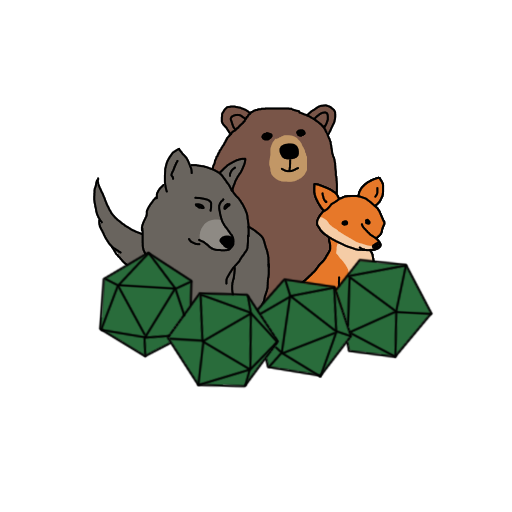

## Description
This module automates many aspects of the **Conjure Animals** spell, allowing players to either receive a random selection of creatures or choose from a list. The GM can then generate tokens for players to control.

## Features
- Easily summon creatures
- Manage summoned creatures
- Customize allowed creatures and the origin compendium
- Change the weights for rolling CR values

## Installation
1. Use the manifest URL to install the module.
https://raw.githubusercontent.com/pteraxor/Conjure-Animals-Helper-Module-for-Foundry-VTT-/refs/heads/master/module.json

## Usage
To use the module, the player can click the **"Conjure Animals"** button in the Actors tab. 

### Random Selection
This opens a prompt where the player can choose to get animals randomly or select them manually. If random, it rolls a CR based on weights set in the settings and then selects a random creature with that CR.

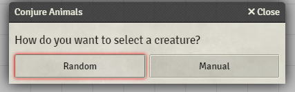

### Manual Selection
If choosing manually, the player must first select a CR rating and then an animal from a dropdown.

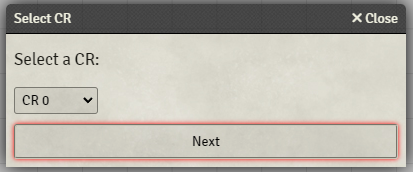  
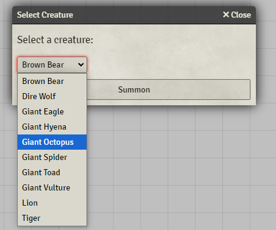

This generates a chat message with all the information and options for the GM.

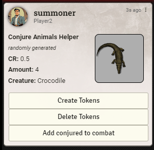

### Token Generation
When the GM summons the creatures, the tokens are added near the summoner.

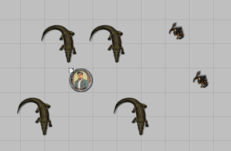

The player who summoned them can control the tokens and view their sheets.

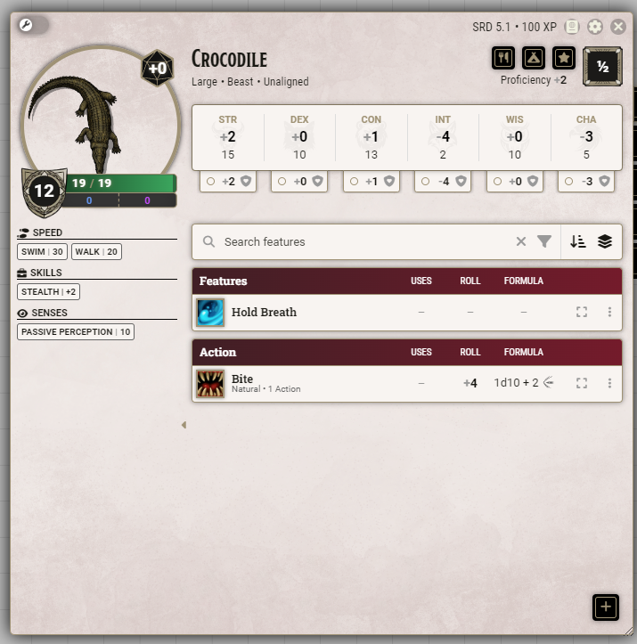

### Combat Integration
If there is an active combat, the conjured animals roll a single initiative and join the combat automatically. They can be added to a later combat with a button, or removed altogether from the first chat message.

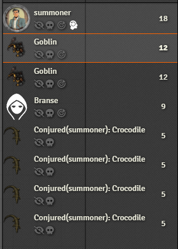

## New Features!!!

Now there are more options to make things easier on the player and the dm.

### Multirolls
The player can press a new button to roll multiple actions at once.

All of the rollable attacks from the conjured animals are loaded into a screen, with some details and the option to roll for them.

There is an option for advanced rolls, if you want to manage advantage and disadvantage. Or you can just click roll and they all roll straight.

These rolls are all shown in the chat, with options similar to a usual action clicked from the character sheet. Including resistances if applicaple.

When rolling for damage, it will select hit and miss automatically for 1s and 20s, but everything can be adjusted as well in the popup. Empty selections default to miss.

#### DM side

The damage rolls show up normally in the chat. And allow the DM the usual options for damaging

Attacks with saving thows are used like usual for the DM, where you can select a token and press the button.

## DM Other features

### Automatic Removal
if a conjured creature reaches 0 HP, the DM will be asked if they want it removed from the combat tracker and the scene.

### Management buttons

There are new buttons for the DM. one deletes everything, and the other opens a management screen.

The screen allows you to view the conjured, and info about them. And dismiss them individually.

## Now Compatible with "Dice So Nice"

Here's a litte demo of the new features and how any 3D dice simulator should work with it automatically

## Configuration
Everything is ready to go, but there are options you can change.

### CR Weight Settings
The settings allow the GM to choose the weights for the CR rolling.

### Compendium Settings
The settings also allow the GM to choose a different compendium to load creatures from. When selecting another compendium, the GM must choose which subfolders are used.

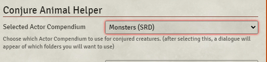  
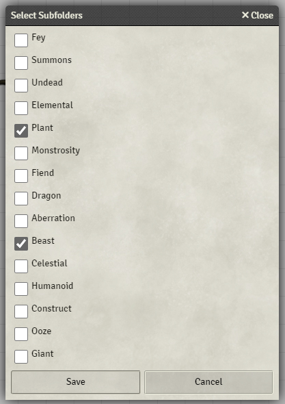

### Actor Selection
The GM can also specify which actors to use. By default, all animals explicitly mentioned in the **Conjure Animals** spell are loaded.

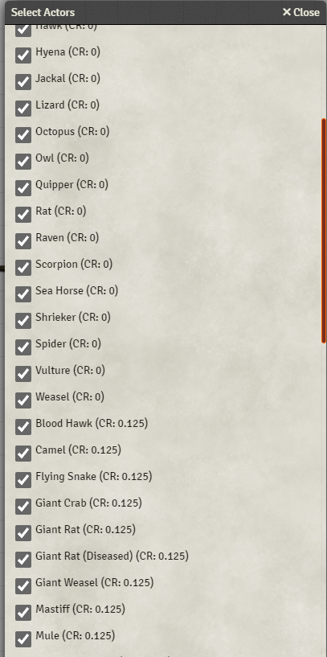

### Troubleshooting

- after loading a new compendium, try refreshing if things are acting strange. It cannot aut reload, because it needs to take the time to populate everything
- If nothing is loaded, try loading another compendium, and loading back to default one afterwards.

##Button Alternatives

-if you don't want the buttons to be on the actor tab, you can use macros instead. I will work on packing them with it.
-but in the meantime, the functions that need to be accessed are as follows:

Dialogue for selecting or generating random animals:
showConjureAnimalsDialog();

Dialogue for rolling multiple actions:
showConjuredAnimalsActionManagement();

Dialogue for DM conjured animals managemnet screen:
showConjuredAnimalsManagement();

DM options for deleting conjured animals:

deleteAllConjuredTokens();
removeConjuredCombatants();

All of these can be made into script macros if you prefer to use that instead of the buttons. The buttons can be turned off in settings.
