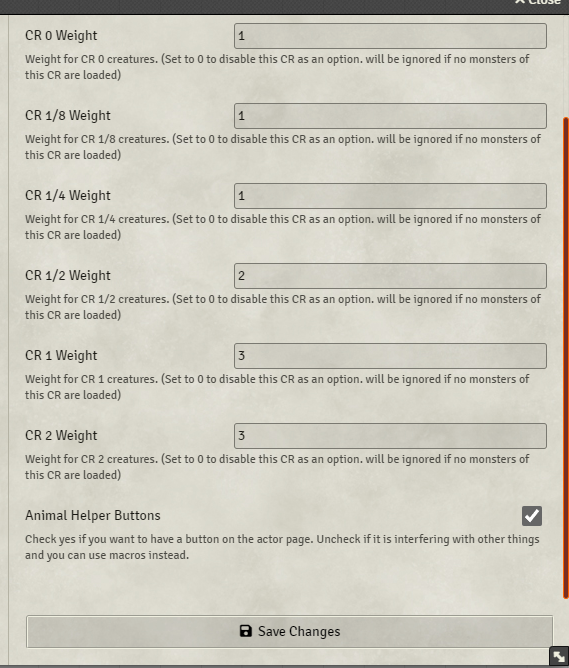

# Conjure Animals Helper

## Description
This module automates many aspects of the **Conjure Animals** spell, allowing players to either receive a random selection of creatures or choose from a list. The GM can then generate tokens for players to control.

## Features
- Easily summon creatures
- Manage summoned creatures
- Customize allowed creatures and the origin compendium
- Change the weights for rolling CR values

## Installation
1. Use the manifest URL to install the module.
https://raw.githubusercontent.com/pteraxor/Conjure-Animals-Helper-Module-for-Foundry-VTT-/refs/heads/master/module.json

## Usage
To use the module, the player can click the **"Conjure Animals"** button in the Actors tab. 

### Random Selection
This opens a prompt where the player can choose to get animals randomly or select them manually. If random, it rolls a CR based on weights set in the settings and then selects a random creature with that CR.

### Manual Selection
If choosing manually, the player must first select a CR rating and then an animal from a dropdown.

  

This generates a chat message with all the information and options for the GM.

### Token Generation
When the GM summons the creatures, the tokens are added near the summoner.

The player who summoned them can control the tokens and view their sheets.

### Combat Integration
If there is an active combat, the conjured animals roll a single initiative and join the combat automatically. They can be added to a later combat with a button, or removed altogether from the first chat message.

## Configuration
Everything is ready to go, but there are options you can change.

### CR Weight Settings
The settings allow the GM to choose the weights for the CR rolling.

### Compendium Settings
The settings also allow the GM to choose a different compendium to load creatures from. When selecting another compendium, the GM must choose which subfolders are used.

  

### Actor Selection
The GM can also specify which actors to use. By default, all animals explicitly mentioned in the **Conjure Animals** spell are loaded.

